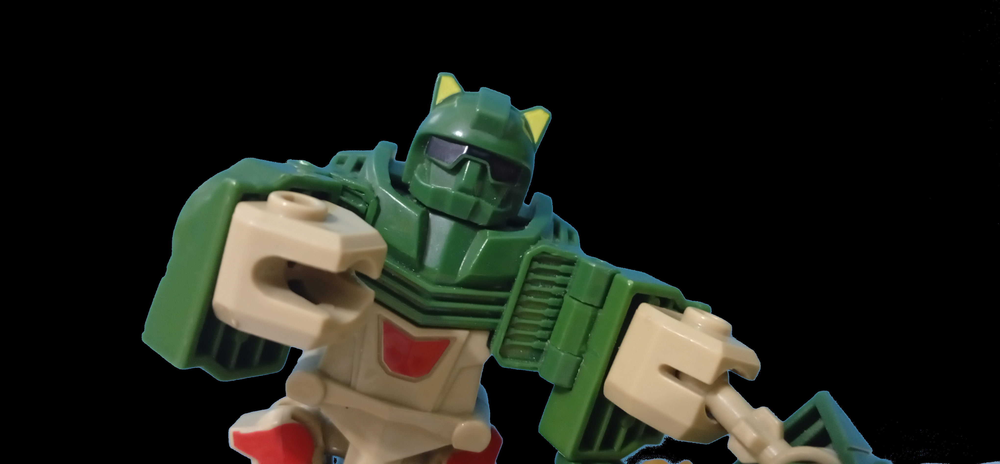
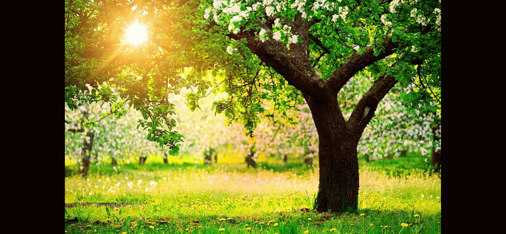
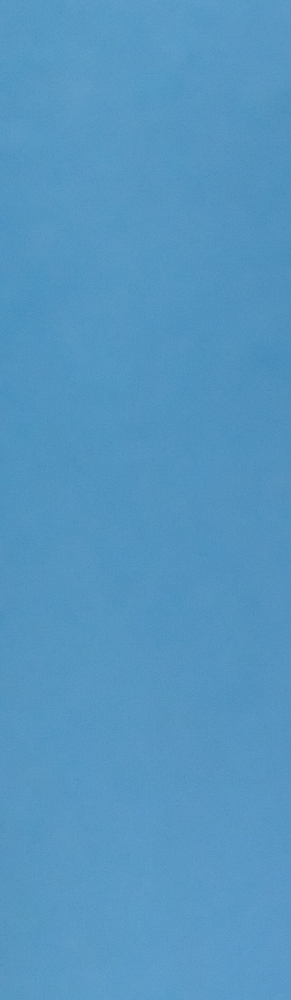
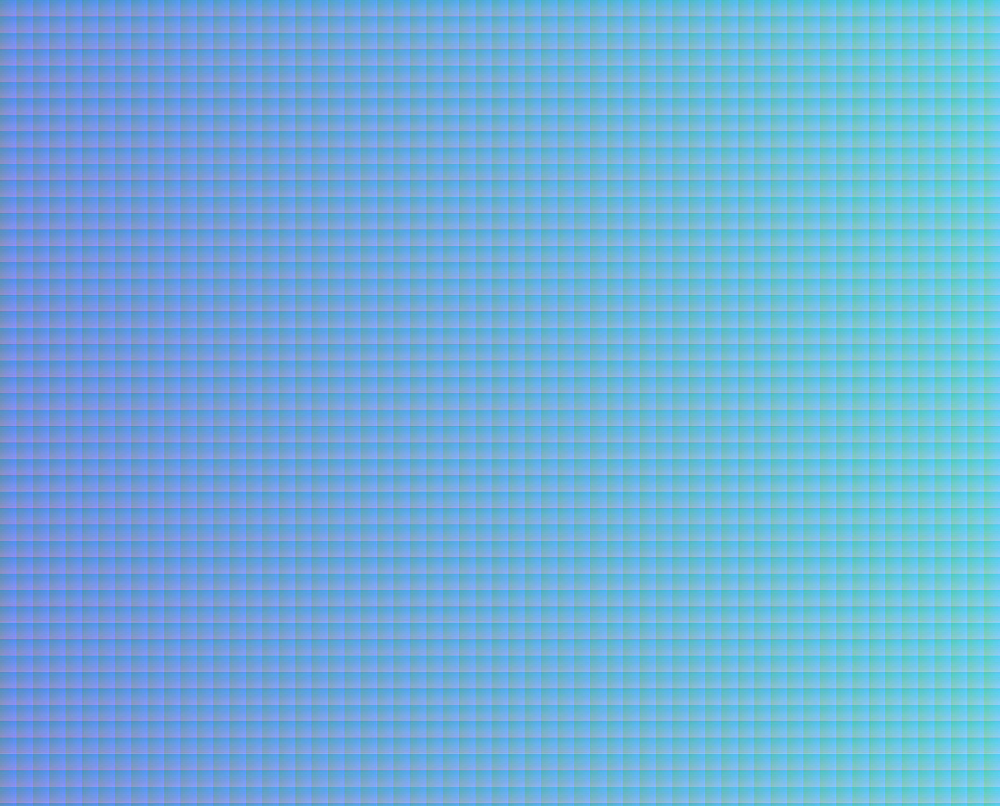

# Image Compositing and Matting-PYTHON-EDITION-

This project performs simple image compositing and artifact-based color correction using opencv and numpy. It uses PNG input images to isolate and blend foreground and background regions, applying alpha matting logic for compositing.

## Example Output
*foreground*


-->

*alpha \* foreground*



-->

*background*



-->

*(1-alpha) \* background*


-->

*(1-alpha) \* background + alpha \* foreground*


## Features

- Load images (foreground, background, artifact)
- Apply artifact-based color correction (RGB offset)
- Generate alpha matte from artifact image with user specified tolerance
- Composite foreground over background using the matte
- Save the final blended image

*artifact Example (the wall behind the robot)*



*example map of tolerance = 30, if unspesified tolerance = 0*  


## 📦 Dependencies

This project requires the following Python libraries:

1. **NumPy** – Fundamental package for numerical computing  
   - Website: [https://numpy.org/](https://numpy.org/)  
   - Installation:  
     ```bash
     pip install numpy
     ```

2. **OpenCV (cv2)** – Computer vision and image processing library  
   - Website: [https://opencv.org/](https://opencv.org/)  
   - Installation (prebuilt package):  
     ```bash
     pip install opencv-python
     ```

## How to Use

1. Provide images: artifact, foreground, and background.
2. Run the program — it will generate a result image using the compositing process where you can save the image to enjoy it.

---

*Developed by Mohammed Yasser Mohammed* 
*call me ;)*


*email : es-mohamed.yasser2027@alexu.edu.eg* 

